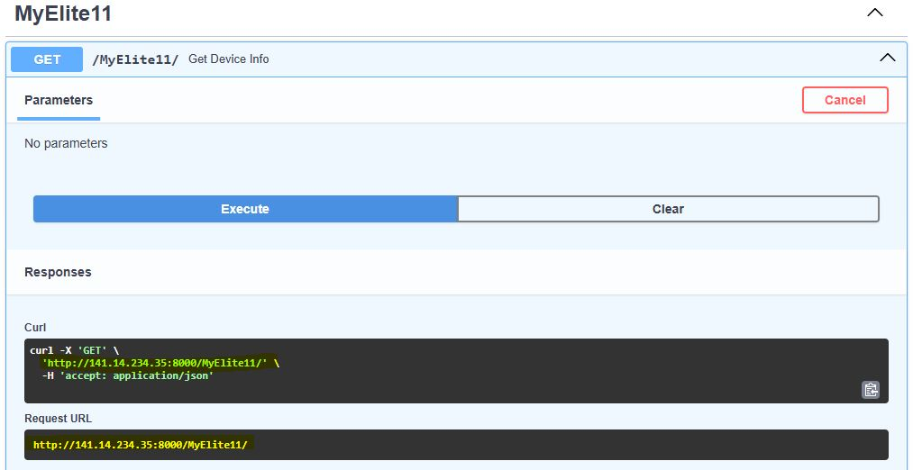

# Tools

There are additional tools in flowchem to help users create the configuration file and utilize the API server.

## Autodiscover

Some devices implemented in flowchem can be discovered using the autodiscover function present in flowchem. To activate
this function, simply type the command in the command window.

```shell
flowchem-autodiscover
```
Autodiscover will examine the local network using Zeroconf service discovery to verify if there are any devices
connected through Ethernet. Additionally, it will search for devices connected through serial connections based on
the user's preferences.

```{warning}
The autodiscover include modules that involve communication over serial ports. These modules are *not* guaranteed to be
 safe. Unsupported devices could be placed in an unsafe state as result of the discovery process!
```

After the examination, a configuration file will be generated with the main characteristics of each identified device.
This feature saves time when creating the configuration file. The file named `flowchem_config.toml` created is placed
in the flowchem package folder

```{note}
Some additional information is generally still necessary even for auto-detected devices.
```

Complete the missing information (if any) in this file, and then you will be ready to use flowchem!

```{note}
`flowchem_config.toml` is written in [TOML format](https://en.wikipedia.org/wiki/TOML),
the syntax of this language is intuitive and designed to be human-editable.
If you follow this guide you will not need to learn anything about the TOML syntax, but you can just copy and modify the
examples provided.
```

:::{note}
Not all the devices supported by flowchem can be auto discovered, so you might need to edit the configuration
file manually for some device types.
:::

## Accessing API

This function searches for flowchem devices on the network and returns a dictionary where the keys are device names
and values are API devices instances.

```python
from flowchem.client.client import get_all_flowchem_devices

devices = get_all_flowchem_devices()
```

This variable `devices` can be referred to as "client," as it is a client built on top of flowchem that utilizes its
functionalities.

In a similar way that you can access the functionalities of the devices through the API, you can use the client devices.
For example, if you have an Elite11 pump, called *pumpG*, running on flowchem, you can send an infuse command to the
pump
with a volume
of 10 ml and a flow rate of 1 ml/min through the API in the browser.


With the client `devices`, this can be done in Python. Using the client `devices`, the construction of protocols directly
in Python is facilitated.

```python
from flowchem.client.client import get_all_flowchem_devices

devices = get_all_flowchem_devices()

devices["PumpG"]["pump"].put("infuse", {"volume": "10 ml", "rate": "1 ml/min"})
```

The example shown in section [example](examples/reaction_optimization.md) presents one way of how the
protocols can be constructed.

### Direct approach

To efficiently discover devices exposed by a FlowChem server—especially when dealing with a large number of devices or multiple servers on the intranet—we recommend using the direct approach. In this approach, the user manually provides the IP address (or URL) of the desired server.

This address can be obtained from the FastAPI web interface (see illustration below).


Figure: Accessing the server URL via FastAPI interface

Once the address is known, the function below (get_flowchem_devices_from_url) can be used to create clients for each available device on the server:

```python
from flowchem.client.client import get_flowchem_devices_from_url

devices = get_flowchem_devices_from_url(url="http://141.14.234.35:8000/")

devices["PumpG"]["pump"].put("infuse", {"volume": "10 ml", "rate": "1 ml/min"})
```

This function queries the OpenAPI specification exposed by the server and returns a dictionary of initialized FlowchemDeviceClient instances, each corresponding to one device.


## Flowchem-Sim approach

The Flowchem-Sim approach starts a Flowchem server in simulation mode. It uses the same TOML configuration file as a
normal Flowchem server, but replaces each supported real device class with a corresponding simulation class before the
server is started. The result is an API server that looks and behaves like a regular Flowchem server from the client side,
without requiring the physical instruments to be connected.

This is useful when writing protocols, testing client code, preparing demonstrations, or checking that a configuration
file exposes the expected API endpoints before using real hardware. Because the public API is preserved, a protocol can
usually be developed against the simulated server and then moved to the real setup by starting `flowchem` instead of
`flowchem-sim` with the same configuration file.

```{warning}
Simulation mode does not validate the physical feasibility or safety of an experiment. It confirms that the Flowchem
configuration, server, components, and API calls are structurally correct, but it cannot guarantee that the connected
hardware will behave safely or that the chemistry will work as expected.
```

### What is simulated

When `flowchem-sim` starts, Flowchem reads the `[device.*]` sections in the TOML file and maps each `type` to a simulated
implementation. For example, a pump, valve, chiller, autosampler, or sensor can expose the same components and endpoints
as the real device while storing its internal state in software. The tests in `tests/sim` use this approach to start a
complete simulated server and exercise the documented endpoints exposed by the configured devices.

Only device types that have a simulation implementation can be used in this mode. If a configured device type is not
available in the simulation registry, `flowchem-sim` stops during startup with an error explaining that simulation support
is missing for that device type.

### How to start a simulated server

Create or reuse a regular Flowchem configuration file. The file does not need a special simulation syntax; use the same
device names, `type` values, and device-specific settings that you would use for the real server. For simulated serial or
network devices, placeholder values such as `COM_SIM` or `127.0.0.1` are commonly used, because the simulator does not
open the real connection.

Example:

```toml
[device.sim-elite11]
type = "Elite11"
port = "COM_SIM"
syringe_diameter = "14.567 mm"
syringe_volume = "10 ml"

[device.sim-runze]
type = "RunzeValve"
port = "COM_SIM"
num_ports = 6
```

Start the server with `flowchem-sim`:

```shell
flowchem-sim path/to/config.toml
```

For debugging, add the `--debug` flag:

```shell
flowchem-sim --debug path/to/config.toml
```

By default the server binds to all addresses. To restrict it to the local machine:

```shell
flowchem-sim --host 127.0.0.1 path/to/config.toml
```

Once the server is running, open the URL printed in the terminal, usually `http://127.0.0.1:8000`, to inspect the FastAPI
interface and available endpoints.

### How to use the simulated server from Python

Use the same client helpers described above. The recommended approach is to connect directly to the simulated server URL:

```python
from flowchem.client.client import get_flowchem_devices_from_url

devices = get_flowchem_devices_from_url(url="http://127.0.0.1:8000/")

devices["sim-elite11"]["pump"].put(
    "infuse",
    {"volume": "1 ml", "rate": "1 ml/min"},
)
```

The client code does not need to know whether the server is simulated or connected to real hardware. This makes it a good
workflow for developing protocols in two steps:

1. Start `flowchem-sim` with the planned configuration and develop the protocol against the simulated endpoints.
2. When the protocol and configuration are ready, stop the simulated server and start the real server with `flowchem`.

The file `tests/sim/test_config_sim.toml` contains a larger example configuration used by the Flowchem test suite. It is
a practical reference for the device types currently covered by the simulation approach.

